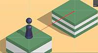
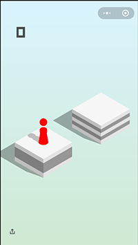
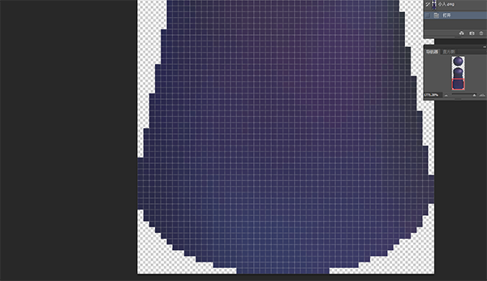
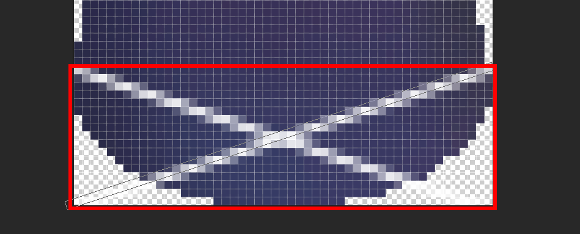

# 微信自动跳一跳

**申明：**

- 该脚本是通过学习[wangshub](https://github.com/wangshub)的[wechat_jump_game](https://github.com/wangshub/wechat_jump_game) 来实现的

- 感谢[wangshub](https://github.com/wangshub)的开源

## 使用环境

- 手机：   红米4A

- 分辨率： 720*1280

## 实现原理

- 简述：
    1. 找出小人底盘的中心点坐标(center_x, center_y)
    2. 找出所要跳到的目标位置(target_x, target_y)
    3. 调用adb使小通过人跳到目标位置

- 详述：
    1. 第一步，重要的一步！ 调用adb截图！ 截图！
    
    2. 找出小人底盘的中心点坐标：
        - 通过ps足够放大小人图片，可以发现小人最下方是一条直线
        
        - 通过该直线的像素值来找出该直线（通过ps一个一个的测，点不多）
        
        - 计算出该直线的中点横坐标x（即为小人底盘的中心点横坐标center_x)
        - 小人底盘中心点center_y可通过ps放大图片算出中心点距离上述直线的偏移值（可以用数的，哈哈哈哈哈)
        - 至此就可以找出小人底盘中心点的坐标(center_x, center_y)

    3. 找出所要跳的目标位置的坐标(target_x, target_y)：
        - 明确所要跳的目标位置的坐标在小人底盘中心点坐标的上方（可以减少遍历的范围）
        - 遍历图片，每行的第一个像素值必为背景的颜色像素值，获取该像素值，随后该行寻找是否存在像素值各分量与背景颜色像素值各分量的差值的绝对值的和大于10以上的（大于10表示该位置已经不是背景点了，是目标盒子的像素值了）
        - 上述找到的满足的第一个行的中点也就是目标位置的横坐标target_x
        - 找目标位置的纵坐标较难，借鉴[wangshub](https://github.com/wangshub)的方法，[wangshub](https://github.com/wangshub)发现每次小人跳跃的角度基本不变，所以可以先取一次样例，算出两个坐标点tan值(正切值)
        **通过ps的标尺来计算出tan值**
        
        - 至此求出目标位置的坐标(target_x, target_y)

    4. 按压时间与距离的关系
        - 由于每次小人向前跳，背景也会跟着向前移动，导致难以直接测量按压时间与距离的关系
        - 所以借鉴[wangshub](https://github.com/wangshub)的方法，按压时间=距离x按压时间系数
        - [wangshub](https://github.com/wangshub)的方法应该是经验和观察得出的
        - 距离用勾股定理求出
        - 按压时间系数最好自己根据自己的手机做微调

## 吐槽
*做该脚本过程诸多的波折*

### 标记小人
- 最开始找小人底部中心点时，想着先把小人标记出来吧(找出的小人如图中的红色小人)

- 找这个小人。。也是费了一番功夫，先是使用dfs算法（递归实现），由于递归实现导致处理一张图片需要10s的时间，因为一张图片有720*1280个像素（百万级的数据）..然后就换用bfs（队列实现），将处理一张图片的时间降低到1s。
- 噢。开始是用像素值的区间来标记出小人，但是，但是！！找出来的小人不完美
- 追求完美的我，先用ps扣出小人的完美图。对，是用矩形框选择来一点一点扣的，精确到每个像素值，不是用魔棒

**完美的小人**

**精确到每个像素**

- 然而。。最终发现，找出小人其实并没什么用，通过观察可知小人最下方其实是一条直线！！

- 其实找出小人底盘的中心点也可以先通过找出底部这样的矩形，然后求中心即可。

### 按压时间与距离

- ！！最最奔溃的一块，本来想通过收集按压时间和小人跳动距离来拟合出小人跳动距离与按压时间的关系
- 但是，由于小人每次向前跳动，背景也会向前移动，导致不好测量，所以使用了[wangshub](https://github.com/wangshub)的方法